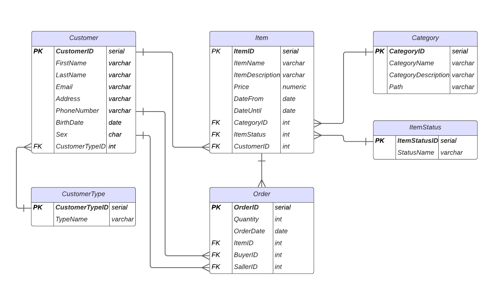

# Challenge SQL | Ecommerce

## Descripción de las relaciones del DER
- Un Customer puede realizar muchas Orders, pero cada Order pertenece a un Customer. Esta es una relación de (1:N)

- Un Item pertenece a una sola Category, pero una Category puede tener muchos Items. Esta es una relación uno a muchos (1:N)

- Una Order puede contener un solo Item, pero un Item puede estar en muchas Orders. Esta es una relación uno a muchos (1:N). Opte por esta solución dado que el enunciado indica lo siguiente *"cada ítem que se venda será reflejado en una order independientemente de la cantidad que se haya comprado"*, interpreto que no hay una relación muchos a muchos entre Item y Order sino hubiera puesto una tabla intermedia llamada OrderItem

- Un Item tiene un ItemStatus, pero un ItemStatus puede estar en varios Items. Esta es una relación de (1:N)

- Un Customer tiene un CustomerType y un CustomerType puede estar en varios Customer. Esta es una relación de (1:N)

- Un Customer puede vender varios Items y un Item tiene un Customer. Esta es una relación de (1:N) 