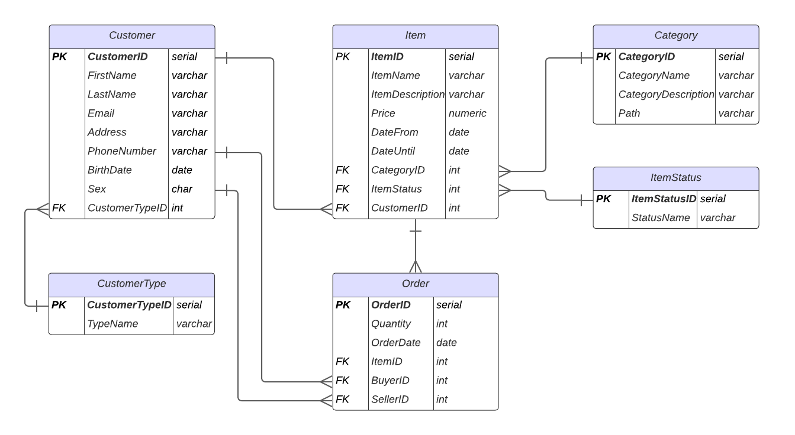

# Challenge SQL | Ecommerce

## Objetivo
A partir de la siguiente necesidad, se requiere diseñar un DER que responda al modelo del negocio. Luego, se debe responder mediante SQL diferentes preguntas.

## Descripción de la necesidad
Teniendo en cuenta el modelo de ecommerce que manejamos, tenemos algunas entidades
básicas que queremos representar: Customer, Order, Item y Category.

- Customer: Es la entidad donde se encuentran todos nuestros usuarios, ya sean
Buyers o Sellers del Site. Los principales atributos son email, nombre, apellido, sexo,
dirección, fecha de nacimiento, teléfono, entre otros.

- Item: Es la entidad donde se encuentran los productos publicados en nuestro
marketplace. El volumen es muy grande debido a que se encuentran todos los
productos que en algún momento fueron publicados. Mediante el estado del ítem o
fecha de baja se puede detectar los ítems activos del marketplace.

- Category: Es la entidad donde se encuentra la descripción de cada categoría con su
respectivo path. Cada ítem tiene asociado una categoría.

- Order: La order es la entidad que refleja las transacciones generadas dentro del site
(cada compra es una order). En este caso no vamos a contar con un flujo de carrito de compras por lo tanto cada ítem que se venda será reflejado en una order
independientemente de la cantidad que se haya comprado.

## Descripción de las relaciones del DER

- Un Customer puede realizar muchas Orders, pero cada Order pertenece a un Customer. Esta es una relación de (1:N)

- Un Item pertenece a una sola Category, pero una Category puede tener muchos Items. Esta es una relación uno a muchos (1:N)

- Una Order puede contener un solo Item, pero un Item puede estar en muchas Orders. Esta es una relación uno a muchos (1:N). Opte por esta solución dado que el enunciado indica lo siguiente *"cada ítem que se venda será reflejado en una order independientemente de la cantidad que se haya comprado"*, interpreto que no hay una relación muchos a muchos entre Item y Order sino hubiera puesto una tabla intermedia llamada OrderItem

- Un Item tiene un ItemStatus, pero un ItemStatus puede estar en varios Items. Esta es una relación de (1:N)

- Un Customer tiene un CustomerType y un CustomerType puede estar en varios Customer. Esta es una relación de (1:N)

- Un Customer puede vender varios Items y un Item tiene un Customer. Esta es una relación de (1:N)

## A resolver
1. Listar los usuarios que cumplan años el día de hoy cuya cantidad de ventas
realizadas en enero 2020 sea superior a 1500.

2. Por cada mes del 2020, se solicita el top 5 de usuarios que más vendieron($) en la
categoría Celulares. Se requiere el mes y año de análisis, nombre y apellido del
vendedor, cantidad de ventas realizadas, cantidad de productos vendidos y el monto
total transaccionado.

3. Se solicita poblar una nueva tabla con el precio y estado de los Ítems a fin del día.
Tener en cuenta que debe ser reprocesable. Vale resaltar que en la tabla Item,
vamos a tener únicamente el último estado informado por la PK definida. (Se puede
resolver a través de StoredProcedure)